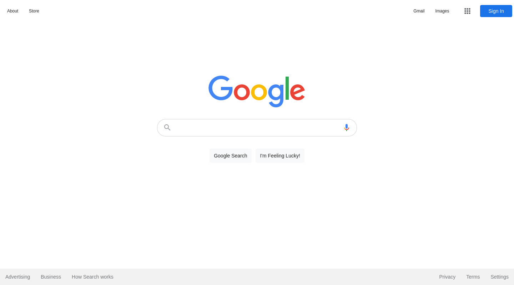

# The Odin Project - Google Homepage Clone

This is a clone of the Google homepage, deconstructed and rebuilt for [The Odin Project](https://www.theodinproject.com). The goal is to start thinking about how elements get placed on the page and roughly how they get styled and aligned.

## Table of contents

- [Overview](#overview)
  - [Instructions](#instructions)
  - [Screenshot](#screenshot)
  - [Links](#links)
- [My process](#my-process)
  - [Built with](#built-with)
  - [Things to remember](#things-to-remember)
  - [Things to work on](#things-to-work-on)
  - [Useful resources](#useful-resources)
- [Author](#author)

## Overview

### Instructions

- Any dropdown menus or form submissions or hover-highlighting should be ignored.
- Start with just putting the main elements on the page (the logo image and search form), then get them placed horizontally.
- Next do the navbar across the top, first building the content and then trying to position it.
- Finally, put in the footer, which should be very similar to the top navbar.

### Screenshot



### Links

- [Solution](https://github.com/je-jo/google-homepage)
- [Live Site](https://je-jo.github.io/google-homepage/)

## My process

### Built with

- Semantic HTML5 markup
- CSS custom properties
- Flexbox
- Mobile-first workflow

### Things to remember

- The simplest way for a page to cover the whole wiewport:

```
html, body {
  width: 100%;
  height: 100%;

.page-wrapper {
  height: 100%;
}
``` 
- Temporarily use red outline to easily see the placement of all elements.

```
* {
  outline: 1px solid red;
}
``` 

- It's a good idea to style an input wrapper, rather than the input itself.

### Things to work on

- More forward-planning, less trial-and-error!

- Look into fluid typography.

- Look into manipulating SVG.

### Useful resources

- [Minireset](https://awesomeopensource.com/project/jgthms/minireset.css?categoryPage=29) - A tiny modern CSS reset. 
- [Material Icons](https://fonts.google.com/icons) - Based on the core Material Design principles and metrics. 

## Author

- [Github](https://github.com/je-jo)
- [Frontend Mentor](https://www.frontendmentor.io/profile/je-jo)
- [Codepen](https://codepen.io/je-jo)